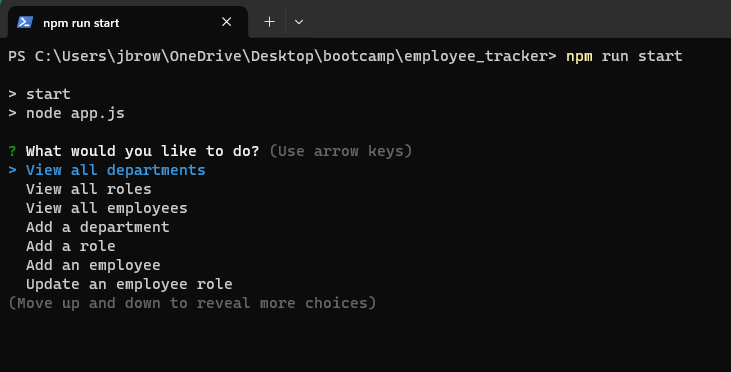

# Employee Tracker

## Description

A simple SQL app that allows you to keep track of and add update and remove employees, departments, and roles in your organization.

## Table of Contents

- [Installation](#installation)
- [Usage](#usage)
- [License](#license)
- [Contributing](#contributing)
- [Tests](#tests)
- [Questions](#questions)
- [Resource](#resource)

## Installation

clone the repository, create the database by running npm run dbinit, seed the database for testing with npm run seed, start the app by running npm run start

## Usage

As a simple tool to manage your organizational structure

## Contributing

create a react front end for the database

## Tests

run the seeded data and go through the prompts

## Questions

For any questions, please contact me at [j.browning527@gmail.com](mailto:j.browning527@gmail.com) or visit my [GitHub profile](https://github.com/jbrowning824).

This project is licensed under the MIT License. For more information, see the link below:
    [Lincense Link] (https://api.github.com/licenses/mit)

## Resource

See the repo [Employee_Tracker](https://github.com/jbrowning824/employee_tracker) 

Check out the [walkthrough](https://drive.google.com/file/d/1eyIUxywrLG6iTgiPNje7V9NmbazMohOP/view)